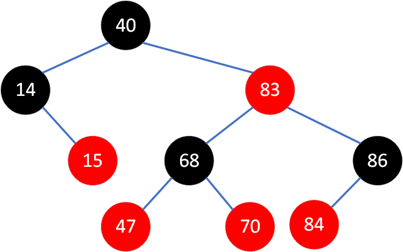
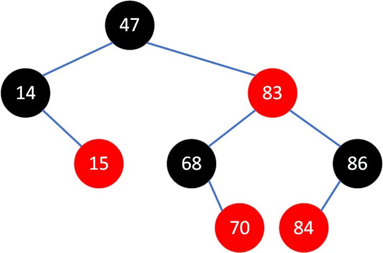

# Алгоритмы и структуры данных (семинары)
## Урок 4. Структуры данных дерево и хэш-таблица

### **Задание:**

Необходимо превратить собранное на семинаре дерево поиска в полноценное левостороннее красно-черное дерево. И реализовать в нем метод добавления новых элементов с балансировкой.

Красно-черное дерево имеет следующие критерии:
* Каждая нода имеет цвет (красный или черный)
* Корень дерева всегда черный
* Новая нода всегда красная
* Красные ноды могут быть только левым ребенком
* У красной ноды все дети черного цвета

Соответственно, чтобы данные условия выполнялись, после добавления элемента в дерево необходимо произвести балансировку, благодаря которой все критерии выше станут валидными. Для балансировки существует 3 операции – левый малый поворот, правый малый поворот и смена цвета.

***
## Решение:
Разработан класс для работы с красно-черным левосторонним деревом. 

Реализованы следующие методы:
* Добавление элемента
* Поиск элемента
* Удаление элемента

Для балансировки дерева реализованы служебные методы:
* Левый поворот поддерева
* Правый поворот поддерева
* Непосредственно - сама балансировка (правильное выстраивание цветов узлов)

Текст программы представлен в этом репозитарии.

***
### Результат работы программы:
    ============= Начало работы =============
    Level: 0, Item: 40, Color: Black, Parent: null, Left: 14, Right: 83
    Level: 1, Item: 14, Color: Black, Parent: 40, Left: null, Right: 15
    Level: 2, Item: 15, Color: Red, Parent: 14, Left: null, Right: null
    Level: 1, Item: 83, Color: Red, Parent: 40, Left: 68, Right: 86
    Level: 2, Item: 68, Color: Black, Parent: 83, Left: 47, Right: 70
    Level: 3, Item: 47, Color: Red, Parent: 68, Left: null, Right: null
    Level: 3, Item: 70, Color: Red, Parent: 68, Left: null, Right: null
    Level: 2, Item: 86, Color: Black, Parent: 83, Left: 84, Right: null
    Level: 3, Item: 84, Color: Red, Parent: 86, Left: null, Right: null
    ============= Удаление корня ============
    Level: 0, Item: 47, Color: Black, Parent: null, Left: 14, Right: 83
    Level: 1, Item: 14, Color: Black, Parent: 47, Left: null, Right: 15
    Level: 2, Item: 15, Color: Red, Parent: 14, Left: null, Right: null
    Level: 1, Item: 83, Color: Red, Parent: 47, Left: 68, Right: 86
    Level: 2, Item: 68, Color: Black, Parent: 83, Left: null, Right: 70
    Level: 3, Item: 70, Color: Red, Parent: 68, Left: null, Right: null
    Level: 2, Item: 86, Color: Black, Parent: 83, Left: 84, Right: null
    Level: 3, Item: 84, Color: Red, Parent: 86, Left: null, Right: null
    ============= Конец работы ==============
    
    Process finished with exit code 0
***
#### Наглядное представление изначального дерева

#### Наглядное представление изначального дерева после удаления корня

